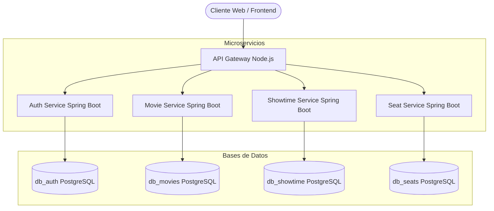
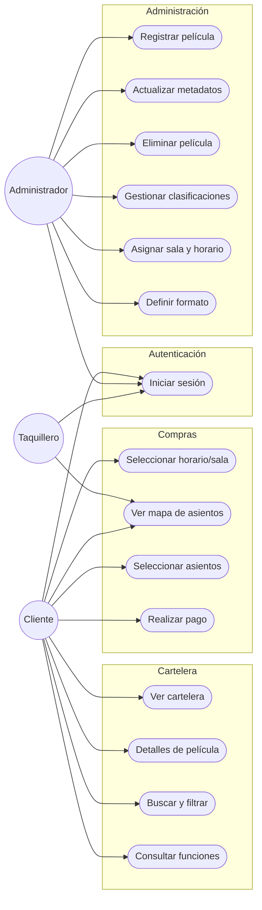
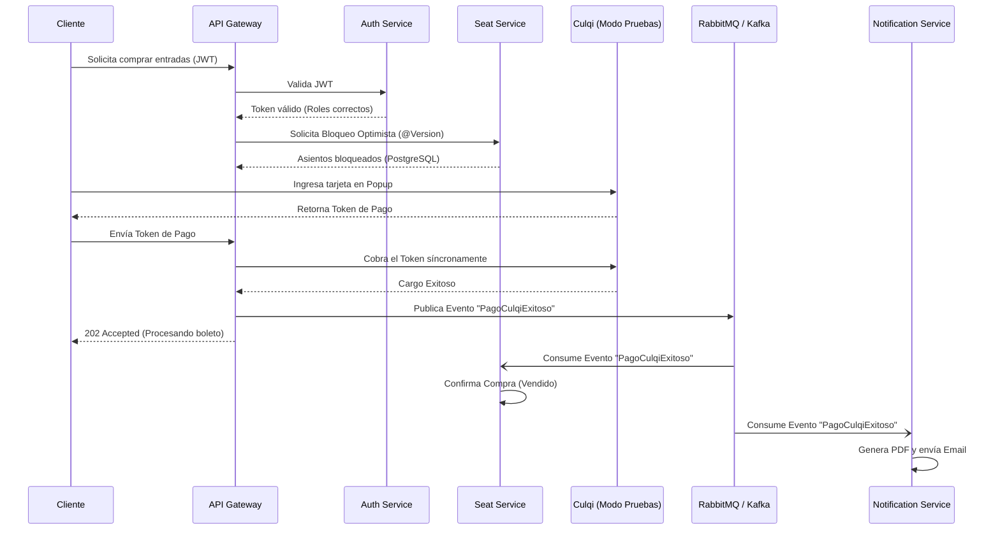

# Arquitectura y Casos de Uso

## 1. Arquitectura de Servicios Autónomos (Monorepo Políglota)
El correcto funcionamiento del sistema de venta de entradas se basa en una arquitectura de microservicios que divide responsabilidades (100% REST vía HTTP/HTTPS) utilizando un patrón de **API Gateway**. Cada servicio tiene su propia base de datos, sin compartir información directamente en persistencia.

### Diagrama de Arquitectura

## 2. Tecnologías Utilizadas
*Revisado e integrado con la especificación técnica del proyecto.*

| Componente | Tecnología | Descripción |
|---|---|---|
| **API Gateway** | Node.js + Express 5 + TS | Único punto de entrada. Orquesta llamadas y valida JWT. |
| **Backend Core** | Spring Boot 4 + Java 17 | Manejo seguro de autenticación (`Auth Service`) y lógica de transacciones complejas (`Seat Service` con Optimistic Locking). |
| **Backend Fast** | Spring Boot 4 + Java 17 + JPA | Servicios de alta velocidad y menor consumo para lecturas concurrentes (`Movie Service` y `Showtime Service`). |
| **Frontend** | Angular + CSS / React | Interfaces dinámicas y responsivas. |
| **Base de Datos** | PostgreSQL 15 | Cuatro bases de datos separadas (puerto 5433). |
| **Caché** | Redis | Manejo de bloqueo temporal de asientos y caché de consultas. |
| **Infraestructura** | Docker Compose + Alpine | Despliegue en contenedores ligeros y multi-stage builds. |

## 3. Casos de Uso del Sistema

### Diagrama General

### Detalle de Casos de Uso
*(Tabla resumen del Borrador omitida en el diagrama para lectura a detalle)*

| ID       | Caso de Uso                       | Actores              | Descripción                                             |
| -------- | --------------------------------- | -------------------- | ------------------------------------------------------- |
| **CU01** | Registrar nueva película          | Administrador        | Permite registrar una nueva película con datos básicos. |
| **CU02** | Actualizar metadatos y multimedia | Administrador        | Permite editar información y actualizar recursos.       |
| **CU03** | Eliminar película                 | Administrador        | Permite eliminar películas fuera de cartelera.          |
| **CU04** | Gestionar clasificaciones         | Administrador        | Asignar o modificar clasificación.                      |
| **CU05** | Asignar sala y horario            | Administrador        | Programar funciones vinculando película y sala.         |
| **CU06** | Definir formato de proyección     | Administrador        | Configurar 2D, 3D, IMAX.                                |
| **CU07** | Ver cartelera actualizada         | Cliente              | Visualizar lista de películas activas.                  |
| **CU08** | Consultar detalles                | Cliente              | Ver información específica de película.                 |
| **CU09** | Buscar y filtrar películas        | Cliente              | Búsqueda por género, clasificación, etc.                |
| **CU10** | Consultar funciones               | Cliente              | Visualizar horarios por fecha y sala.                   |
| **CU11** | Seleccionar horario y sala        | Cliente              | Elegir la función a asistir.                            |
| **CU12** | Visualizar mapa de asientos       | Cliente / Taquillero | Ver estado en tiempo real (Disponible/Ocupado).         |
| **CU13** | Seleccionar asientos              | Cliente              | Marcar los asientos para la compra.                     |
| **CU14** | Realizar pago                     | Cliente              | Procesar pago con pasarela de pago externa.             |
| **CU15** | Iniciar sesión                    | Todos                | Autenticación con credenciales válidas (JWT).           |

## 4. Interacción Entre Servicios

Para orquestar estos casos de uso, los servicios se comunican a través del API Gateway. El siguiente diagrama de secuencia ejemplifica el flujo de compra:

| Escenario Operativo | Servicio Iniciador | Acción Técnica | Servicio Destino |
|---|---|---|---|
| **Consulta Cartelera** | Cliente -> Movie | Solicita películas y metadatos (Caché Redis). | Movie Service |
| **Consulta Funciones** | Movie Service | Solicita horarios para películas (Caché Redis). | Showtime Service |
| **Programación Función**| Admin -> Showtime | Vincula película, sala y horario. | Movie Service |
| **Validación Horarios** | Showtime Service | Verifica no traslapes internamente. | (Interno) |
| **Mapa Asientos** | Cliente -> Showtime | Solicita estructura de sala. | Seat Service |
| **Bloqueo Asientos** | Seat Service | Bloqueo Optimista en Postgres (`@Version`). | (Interno BD) |
| **Confirmación Compra** | Seat Service | Evento Asíncrono: Cambia a Vendido. | Seat Service |
| **Proceso Pago** | Cliente -> Gateway | Cargo de token mediante **Culqi**. | Pasarela Culqi |
| **Notificaciones** | Evento Asíncrono | Genera PDF y envía correo. | Notification Service |
| **Inicio Sesión** | Cliente -> Auth | Emite JWT tras credenciales correctas. | Auth Service |

## 5. Estrategia de Orquestación y Agregación

Para mantener el desacoplamiento y la autonomía de los microservicios sin perder consistencia, el sistema utiliza diferentes patrones según la naturaleza de la operación:

### 5.1. Patrón Agregador (Backend For Frontend - BFF)
Utilizado exclusivamente para **LECTURAS**. El **API Gateway** asume este rol para evitar que el cliente realice múltiples peticiones.
*   **Caso de Uso (Cartelera y Pre-Estrenos):** Cuando el cliente ingresa al Home, el Gateway consulta en paralelo al `Movie Service` (para obtener el catálogo base de películas) y a un endpoint ligero del `Showtime Service` (que devuelve únicamente un arreglo de `movie_id`s con funciones futuras activas, ej. `GET /showtimes/movies/active`). El Gateway fusiona ambos arreglos en memoria, inyecta banderas críticas de negocio (`hasActivePresale`, `hasActiveShowtimes`), y devuelve una respuesta rica y unificada al Frontend. Los microservicios de backend nunca se comunican entre sí para este flujo, evitando así el problema de consultas N+1.

### 5.2. Patrón Orquestador Localizado (Síncrono REST)
Utilizado para **ESCRITURAS** o validaciones críticas donde se requiere **Consistencia Inmediata**. El microservicio que inicia la acción actúa temporalmente como orquestador, comunicándose con otros servicios mediante llamadas REST internas utilizando el cliente nativo **`RestClient` de Spring 6** (Se descartó Spring Cloud OpenFeign para evitar dependencias innecesarias y conflictos de versión).
*   **Caso de Uso (Retirar Película - RF-09):** El `Movie Service` asume el rol de Orquestador. Antes de pasar una película a estado `RETIRADA`, llama síncronamente al `Showtime Service` para preguntar si existen funciones futuras para ese ID. Si las hay, el `Movie Service` aborta el retiro (Rollback virtual) para evitar corromper la cartelera pública.
*   **Caso de Uso (Eliminar Función - RF-16):** El `Showtime Service` asume el rol. Si el admin cancela una función, el `Showtime` debe llamar síncronamente al `Seat Service` ordenando la eliminación o desactivación de los tickets físicos pre-generados para evitar datos huérfanos.
*   **Caso de Uso (Crear Función - RF-14):** El `Showtime Service` asume el rol. Al programar una función, llama síncronamente al `Seat Service` para pre-generar los 150 tickets. Si la generación falla, el `Showtime Service` hace Rollback de la función.
    *   **Nota de Autonomía Excepcional:** Para este caso, el `Showtime Service` **NO** valida la existencia del `movie_id` de forma síncrona con el `Movie Service`. Delega esa confianza a la UI del Administrador (Frontend), la cual ya provee un ID válido de su propio catálogo. Esto evita acoplamiento temporal innecesario.
    *   **Estado Actual de Implementación:** Las llamadas síncronas hacia el `Seat Service` usando `RestClient` se encuentran actualmente **COMENTADAS** en el código del `Showtime Service`. Esto se hizo para permitir las pruebas de integración en vivo, dado que el `Seat Service` aún no ha sido implementado. Se deben descomentar una vez el servicio de asientos esté desplegado.

### 5.3. Coreografía Basada en Eventos (Asíncrono)
Utilizado para flujos que toleran **Consistencia Eventual** y requieren máximo rendimiento (Message Brokers como RabbitMQ/Kafka).
*   **Caso de Uso (Flujo de Pagos - RF-24):** Al procesar un pago exitoso con Culqi, no se hacen llamadas REST. Se publica un evento asíncrono (Ej. `PagoCulqiExitoso`). El `Seat Service` actúa como suscriptor reaccionando para cambiar sus butacas de `LOCKED` a `SOLD`. A la par, el `Notification Service` reacciona generando el PDF con código QR y enviando el correo. Nadie espera síncronamente a nadie.
