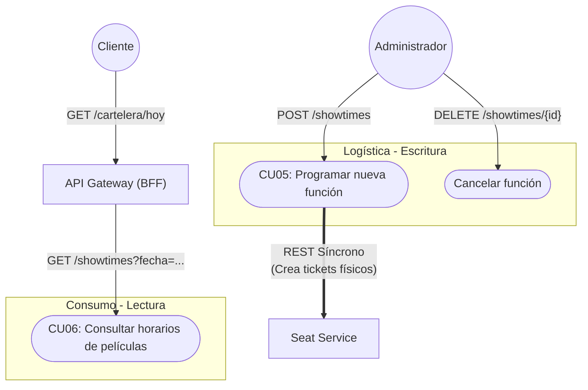

# Showtime Service (Programación de Funciones)

## 1. Responsabilidad
Administrar la programación física del cine: horarios, asignación de salas, formatos de proyección (2D, 3D) y precios base por función. Actúa como el núcleo logístico de la operación, controlando el tiempo y el espacio.

## 2. Stack Tecnológico
*   **Lenguaje:** Java 17
*   **Framework:** Spring Boot 4
*   **Base de Datos:** PostgreSQL 15 (vía Hibernate con Panache)
*   **Caché:** Redis (Para consultas repetitivas de funciones por fecha)
*   **Migraciones:** Flyway
*   **Generador de Código:** OpenAPI Generator (Autogeneración de Interfaces)

## 3. Dependencias Inter-servicio y Orquestación

Este servicio participa en dos flujos de orquestación críticos:

*   **Flujo de Lectura (Inbound - Orquestado por el API Gateway):** 
    Recibe peticiones exclusivamente desde el **API Gateway**. Cuando un cliente quiere ver la cartelera y sus horarios, el API Gateway llama a este servicio para obtener la programación del día, y luego consulta al `Movie Service` para obtener los pósters y descripciones. El `Showtime Service` **NO** se comunica con el `Movie Service` para lecturas.
*   **Flujo de Escritura (Outbound - Orquestado por Showtime Service):** 
    Cuando el Administrador programa una nueva función, este servicio toma el rol de **Orquestador de Transacción**. Envía una petición REST síncrona al `Seat Service` para pre-generar físicamente todos los tickets de esa sala antes de confirmar la creación de la función.

## 4. Configuración y Variables de Entorno

| Variable de Entorno | Descripción | Valor por Defecto / Ejemplo |
| :--- | :--- | :--- |
| `SPRING_DATASOURCE_URL` | Cadena de conexión a la BD | `jdbc:postgresql://localhost:5433/db_showtime` |
| `SPRING_DATASOURCE_USERNAME`| Usuario de la BD | `postgres` |
| `SPRING_DATASOURCE_PASSWORD`| Password de la BD | *(Secreto)* |
| `SPRING_REDIS_HOST` | Cadena de conexión a Redis | `localhost` |
| `SEAT_SERVICE_URL` | URL interna para orquestar asientos | `http://seat-service:8084` |

---

## 5. Casos de Uso del Negocio (Business Flow)



### Lista Oficial de Casos de Uso (Showtime Service)
*   **CU05 - Programar nueva función (Administrador):** Permite asignar una película a una sala física en un horario específico. El sistema previene solapamientos y orquesta la creación de butacas en el `Seat Service`.
*   **CU06 - Consultar horarios (API Gateway / Cliente):** Retorna la matriz de funciones disponibles para un día en particular. Usado por el API Gateway para fusionar con la data visual de la película.

---

## 6. Estrategia de Persistencia y Caché (`db_showtime`)

### 6.1 Estructura Relacional
*   El `Showtime Service` **no** guarda el nombre de la película ni sus pósters. Guarda únicamente el `movie_id` referencial. 
*   **Regla Anti-Overlap (Solapamiento):** La base de datos (o la capa de negocio) debe validar usando la duración de la película (pasada en la solicitud de creación) que la fecha final calculada no pise otra función en la misma `sala_id`. Además, el sistema **añadirá automáticamente 30 minutos constantes de limpieza** (`CLEANING_TIME_MINUTES = 30`) a la duración de cada película para asegurar que haya tiempo operativo entre funciones. En caso de solapamiento, se retorna HTTP `409 Conflict`.
*   **Regla de Mantenimiento de Salas:** Las salas físicas tienen dos estados: `ACTIVA` y `MANTENIMIENTO`. El cambio de estado es estrictamente manual a través de un endpoint `PATCH /showtimes/salas/{id}/status`. 
    *   Para pasar una sala a `MANTENIMIENTO`, el servicio realizará una validación local de Consistencia Inmediata: verificará que no existan funciones futuras (`fecha_inicio >= ahora`) con estado `PROGRAMADA` para dicha sala.
    *   Si existen funciones futuras, se abortará el cambio retornando `409 Conflict`. El administrador estará obligado a cancelar dichas funciones primero (lo que dispara la orquestación de devolución/anulación de tickets) antes de poder poner la sala en mantenimiento.

### 6.2 Estrategia de Caché en Redis
*   **Búsquedas por Fecha:** Las consultas de funciones de hoy (ej. `GET /showtimes?fecha=2026-06-30`) serán altamente demandadas. Se implementará un **Cache-Aside** en Redis usando la llave `showtimes:{fecha}`.
*   **Invalidación:** Cada vez que el administrador cree, cancele o reprograme una función para una fecha dada, la llave en Redis para esa fecha será eliminada para forzar un refresco inmediato.

👉 **[Ver Documento de Base de Datos: Showtime Service](../04_Base_De_Datos/04_Showtime_Database.md)**

---

## 7. Manejo de Errores y Excepciones (Consistencia Global)

Para mantener total consistencia con la arquitectura general y evitar que el Frontend necesite analizar múltiples tipos de errores, el `Showtime Service` nunca lanzará *Stack Traces* (trazas de error) en texto plano.

### 7.1 Formato JSON Estándar Obligatorio
El servicio responde con un formato JSON idéntico al exigido por el API Gateway. Esto se logra implementando **`@RestControllerAdvice`** globales en Spring Boot que capturan cualquier fallo antes de salir:
```json
{
  "timestamp": "2026-06-25T14:40:00Z",
  "status": 409,
  "error": "Conflict",
  "message": "La sala ya tiene una función programada en ese horario",
  "path": "/api/v1/showtimes"
}
```

### 7.2 Tipos de Excepciones Específicas
A nivel interno de código, Spring Boot lanzará Excepciones tipadas que los Controllers convertirán a los códigos HTTP correspondientes:

*   **`RoomConflictException` (409 Conflict):** Lanzada cuando el administrador intenta programar una función que se solapa con otra existente en la misma sala.
*   **`SeatGenerationFailedException` (500 Internal Server Error):** Lanzada si la llamada síncrona al `Seat Service` falla. Provoca un *Rollback* de la función recién insertada.
*   **`ConstraintViolationException` (400 Bad Request):** Errores de validación de `Bean Validation`.

---

## 8. API Contract (Endpoints)

> **💡 Nota de Arquitectura (Path Mapping):**
> Para que el código generado coincida perfectamente con el API Gateway, el servicio Spring Boot se configurará con un `server.servlet.context-path=/api/v1`. 
> Esto significa que si en el `api-spec.yml` la ruta es `/showtimes`, Spring Boot levantará el endpoint en `http://localhost:8083/api/v1/showtimes` de forma nativa.

### 8.1. Endpoints de Administración (Logística)
> **Seguridad:** Todos estos endpoints son Privados. El API Gateway realizará la **Autenticación** validando el JWT y propagará la identidad (`x-user-roles`). La **Autorización** se hará localmente en el Showtime Service (Spring Boot usará `@PreAuthorize("hasRole('ADMINISTRADOR')")` para bloquear intrusos).

*   **`POST /showtimes`**
    *   **Mapeo:** CU05 (Programar nueva función)
    *   **Propósito:** Crea la función en base de datos y orquesta con el Seat Service.
    *   **Payload Esperado:** `movie_id`, `sala_id`, `proyeccion_id`, `fecha_inicio`, `precio_ticket`.
    *   **Respuesta Exitosa (201 Created):** Función programada y asientos pre-generados de forma segura.
    *   **Respuesta de Error (409 Conflict):** Solapamiento de horarios en la misma sala.

*   **`GET /showtimes/admin`**
    *   **Mapeo:** Visualización logística.
    *   **Propósito:** Retorna la lista completa de funciones sin filtro de estado forzado, permitiendo al administrador buscar funciones históricas, canceladas o futuras.
    *   **Query Params:** `salaId` (opcional), `movieId` (opcional), `status` (opcional).

*   **`DELETE /showtimes/{id}`**
    *   **Mapeo:** CU_Cancel (Cancelar función)
    *   **Propósito:** Cancela una función.
    *   **Orquestación:** Debe hacer una llamada REST síncrona al `Seat Service` para cancelar/desactivar las butacas pre-generadas asociadas a este ID de función. Cambia el estado a `CANCELADA`.

*   **`GET /showtimes/salas`**
    *   **Mapeo:** Catálogo interno.
    *   **Propósito:** Devuelve la lista de Salas activas y sus capacidades. Utilizado por el Frontend del Admin para poblar el `<select>` al crear una función.

*   **`PATCH /showtimes/salas/{id}/status`**
    *   **Mapeo:** Mantenimiento de salas (Regla de negocio).
    *   **Propósito:** Cambia el estado de una sala (ej. de `ACTIVA` a `MANTENIMIENTO`).
    *   **Validación:** Falla con `409 Conflict` si existen funciones futuras programadas para esta sala. No requiere orquestación externa.

*   **`GET /showtimes/proyecciones`**
    *   **Mapeo:** Catálogo interno.
    *   **Propósito:** Devuelve la lista de Formatos de Proyección (2D, 3D, IMAX). Utilizado por el Frontend del Admin para el `<select>`.

### 8.2. Endpoints de Consumo (Lectura para el Gateway)
> **Seguridad:** Estos endpoints son Públicos. No requieren JWT y están optimizados con **Redis Cache**.

*   **`GET /showtimes`**
    *   **Mapeo:** CU06 (Consultar horarios)
    *   **Propósito:** Obtener la programación bruta de un día (Solo funciones `PROGRAMADA`).
    *   **Query Params:** `fecha` (Formato YYYY-MM-DD, requerido).
    *   **Respuesta (200 OK):** Lista de funciones programadas (`id`, `movie_id`, `sala_id`, `fecha_inicio`, `precio_ticket`).

---

## 9. Integración Técnica (Orquestación con Seat Service)

Cuando el administrador ejecuta el `POST /showtimes`, el código en Spring Boot debe hacer lo siguiente:
1. Validar que la sala está disponible en ese bloque horario (Regla Anti-Overlap).
2. Insertar el registro en la tabla `funcion` de PostgreSQL.
3. Hacer una petición `POST http://seat-service:8084/api/v1/seats/generate` (o endpoint interno) enviando el ID de la función y las dimensiones de la sala.
4. Si el `Seat Service` responde `201 Created`, hacer `COMMIT` en PostgreSQL.
5. Si el `Seat Service` responde error o da timeout, lanzar `SeatGenerationFailedException` y hacer `ROLLBACK` de la función en PostgreSQL.

---

## 10. Estrategia de Testing (QA & Automation)

Para asegurar la calidad técnica y evitar solapamientos críticos en la programación de salas, **no se usarán bases de datos en memoria (como H2)**.

### 10.1 Stack Tecnológico de Pruebas
*   **Unit & Integration Tests:** `@SpringBootTest` + `JUnit 5`.
*   **Asersiones REST:** `RestAssured` para simular peticiones HTTP entrantes.
*   **Simulación de Entorno Real:** `Testcontainers`. Levantará contenedores Docker efímeros de PostgreSQL 15 y Redis en cada ejecución de la suite de pruebas. Garantiza que la validación de overlaps a nivel base de datos funcione.
*   **Mocking Externa (Seat Service):** `WireMock`. Evitaremos golpear el servicio real de butacas durante los tests. WireMock levantará un servidor falso para simular respuestas 201 y 500 del Seat Service y probar nuestra orquestación y transaccionalidad.

### 10.2 Acceptance Criteria (Escenarios Core TDD)

*   **Scenario 1: Programación exitosa y Pre-generación**
    *   **Given** un Administrador autenticado y un horario libre en la `Sala 1`
    *   **And** WireMock configurado para responder 201 Created simulando al Seat Service
    *   **When** el Admin hace POST a `/api/v1/showtimes`
    *   **Then** se inserta la función en PostgreSQL, la transacción hace COMMIT, y se retorna HTTP 201.
*   **Scenario 2: Solapamiento de horarios (Overlap)**
    *   **Given** una función ya existente en la `Sala 1` de 14:00 a 16:30
    *   **When** el Admin intenta programar otra función en la misma sala a las 15:00
    *   **Then** la base de datos o lógica de negocio rechaza la operación, retornando el JSON de error estándar con HTTP 409 Conflict.
*   **Scenario 3: Fallo de Orquestación (Rollback)**
    *   **Given** un horario libre en la `Sala 1`
    *   **And** el Seat Service está caído o rechaza la petición (WireMock responde 500)
    *   **When** el Admin hace POST a `/api/v1/showtimes`
    *   **Then** el Showtime Service atrapa el error `SeatGenerationFailedException`, hace ROLLBACK para no dejar funciones fantasma sin asientos, y retorna HTTP 500.
